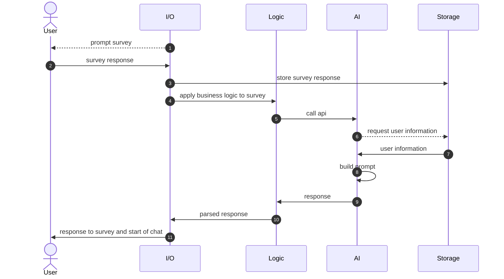

```mermaid
sequenceDiagram
autonumber
actor user as User
participant io as I/O
participant log as Logic
participant ai as AI
participant storage as Storage
io-->>user:prompt survey
user->>io:survey response
io->>storage:store survey response
io->>log:apply business logic to survey
log->>ai:call api
ai-->>storage:request user information 
storage->>ai:user information
ai->>ai:build prompt
ai->>log:response
log->>io:parsed response
io->>user:response to survey and start of chat

```